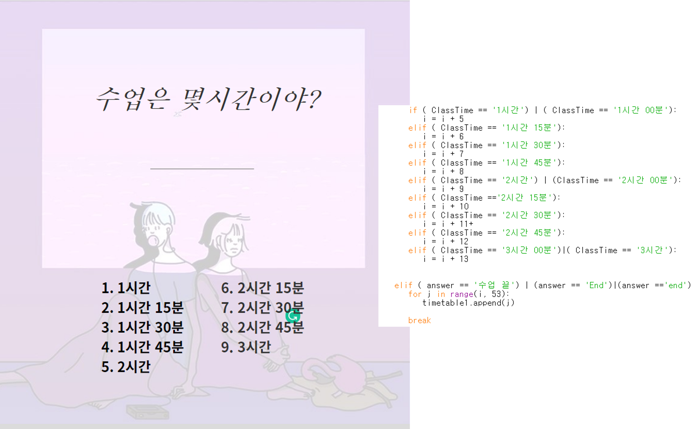

# Scheduling_programming_for_freshman
⏰대학생들을 위한 일정 잡기 프로그램⏰

 
 

   
   
   
   
   

 

  1. 서로 다른 친구들의 시간표를 입력받습니다.
  2. 미리 15분 단위로 오전 9시부터 22시까지 값을 입력해놓은 time table에 각각 되는 시간 안되는 시간을 표기해 친구들끼리 대조합니다.
  3. 안겹치는 시간을 출력해줍니다
	4. python으로 처음 진행한 프로젝트라 비교적 간단한 프로젝트인데, 지금 목표로는 대학생들이 가장 많이 사용하는 에브리타임 강의 스케줄 시간표와 연동하여 사용자들의 공강 시간을 자동으로 계산해 보여주는 프로그램으로 업그레이드 시킬 계획입니다.
  5. 또한, idle로만 실행시키자니 프로그램을 사용하기 불편한 점이 많을 것 같아 gui나 pyqt같은 모듈을 사용해 꾸며볼 계획입니다.
